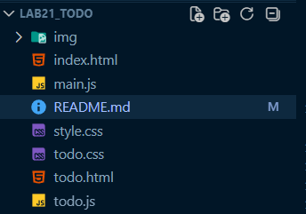

# Лабораторная работа №21. Создание приложения TODO
Цель лабораторной работы: Создать простой TODO-лист [x]

## Основная информация
**ФИО:** *Абдулин Ринат Рушанович*
**Группа:** *ИСП-233*
**Дата:** *31.03.2026*

## Описание (что изучили)
- TODO-лист (список задач) - это классическое приложение для демонстрации работы с DOM. Он объединяет всё изученное:
- Поиск и создание элементов
- Обработку событий
- Работу с формами
- Динамическое обновление интерфейса

## Структура проекта

